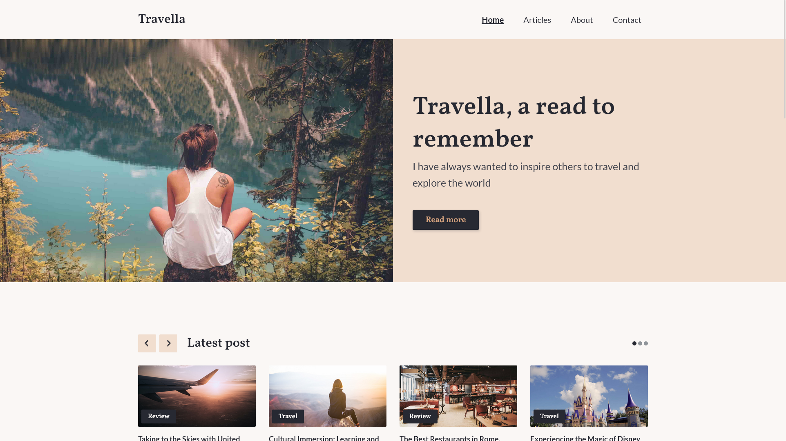

# Travella



A travel blog that includes reviews, photography and travel tips.

[See live site](https://travella-mk.netlify.app/)

## Description

This blog was part of my first year exam at noroff. We were tasked to create a blog with a theme of our choosing and had certain requirements we had to implement.

Some of the requirements

- Functional comment section
- Latest posts carousel
- Using WordPress as headless CMS
- Contact form with validation and sending of message
- Able to see posts by category

## Built With

- HTML
- CSS
- JavaScript
- Wordpress CMS

## Getting Started

### Installing

1. Clone the repo:

```bash
git clone git@github.com:Noroff-FEU-Assignments/project-exam-1-martekn.git
```

## Contributing

If you have any feedback or suggestions to make the project better, please fork the repo and create a pull request.

## Contact

You can contact me on [linkedIn](https://www.linkedin.com/in/martekn/) or send an email to marte.mk@hotmail.com
